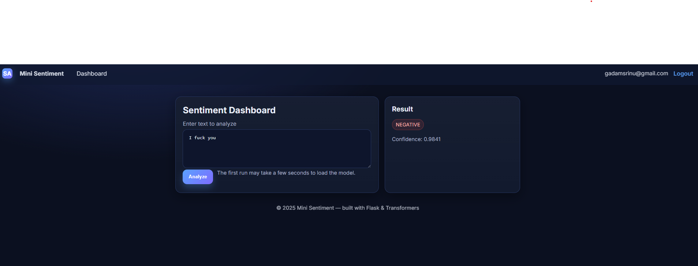

# Mini Sentiment App

A tiny full-stack **Flask** app with **Login / Register**, a **dashboard** to run **sentiment analysis** using 🤗 Transformers (DistilBERT), and a simple **SQLite** database.

  

---

## ✨ Features

- 🔐 Auth: Register / Login (hashed passwords, sessions)
- 🧠 NLP: Sentiment classification (Positive/Negative + confidence)
- 🗃️ DB: SQLite (file: `app.db`)
- 🎨 UI: Clean dark theme (vanilla CSS)
- 🐳 Dockerfile included

---

## 🗂️ Project Structure

mini-sentiment-app/
├─ app.py
├─ models.py
├─ db_init.py
├─ requirements.txt
├─ Dockerfile
├─ .env.example
├─ templates/
│ ├─ layout.html
│ ├─ login.html
│ ├─ register.html
│ ├─ dashboard.html
│ └─ about.html
├─ static/
│ └─ styles.css
└─ docs/
└─ screenshots/
├─ login.png
├─ register.png
├─ dashboard_empty.png
├─ dashboard_result_positive.png
└─ dashboard_result_negative.png

---

## 🚀 Quickstart (Local)

# 1) create venv
python -m venv .venv
# Windows
.\.venv\Scripts\activate
# macOS/Linux
# source .venv/bin/activate

# 2) install deps
pip install -r requirements.txt

# 3) env + db
cp .env.example .env   # optional, set FLASK_SECRET_KEY
python db_init.py

# 4) run
python app.py
# open http://localhost:5000

Windows + PyTorch tip: if you see DLL errors (e.g. fbgemm.dll), install CPU torch:

pip uninstall -y torch torchvision
pip install --no-cache-dir torch torchvision --index-url https://download.pytorch.org/whl/cpu

And in app.py make sure the pipeline is device=-1.

🧠 Model

The app lazy-loads 🤗 pipeline("sentiment-analysis") (DistilBERT fine-tuned on SST-2) and returns:

{"label": "POSITIVE" | "NEGATIVE", "score": 0.0-1.0}

You can swap your own model:

# app.py
from transformers import pipeline
_sentiment = None
def get_classifier():
    global _sentiment
    if _sentiment is None:
        _sentiment = pipeline("text-classification", model="path/to/your/model", device=-1)
    return _sentiment
🖼️ Screenshots

Login
 

Register
 

Dashboard (empty)
 

Dashboard (result: Positive)
 

" alt="Positive result" width="640">
